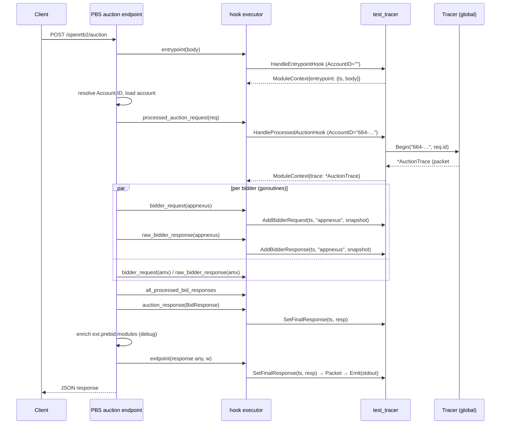

# 03 — Technical Design

Implements [02-specification.md](02-specification.md). PBS facts from [01-analysis.md](01-analysis.md) §3.

## 1. Package layout

The package lives at `modules/test_provider/test_tracer`, the path PBS's generator requires, both in this repository and in the
PBS tree. It imports only PBS and the standard library, so the Dockerfile and `scripts/install-module.sh` copy the directory verbatim.

```text
modules/test_provider/test_tracer/
├── module.go              # Builder, Module, Shutdown; module-context keys; small helpers
├── hooks.go               # the seven hook handlers, one per stage of the plan
├── rules.go               # Rule type and validateRules
├── rules_default.go       # the hardcoded production rule set
├── rules_loadbench.go     # rule set for the load bench (build tag loadbench)
├── tracer.go              # Tracer: per-partner state, trigger and stop conditions
├── trace.go               # AuctionTrace: per-request collector, snapshots
├── packet.go              # TracePacket and the DTOs of the JSON contract
├── emitter.go             # Emitter: jsonEmitter (NDJSON, one Write per packet), asyncEmitter (bounded queue)
├── README.md              # PBS-style module documentation
├── testdata/bid_request.json
├── <file>_test.go         # unit tests next to the file they cover (module, hooks, rules, tracer, trace, emitter)
├── integration_test.go    # the module driven by PBS's real hook executor
├── race_test.go           # TestRace* (PBS convention)
├── bench_test.go          # benchmarks and in-process load criteria
└── helpers_test.go        # fake clock, buffers, fixtures shared by the tests
```

Package name `testtracer` (Go style: no underscores). Directory names are dictated by PBS's generator regex `^([^/]+)/([^/]+)/module.go$`.

## 2. Types and responsibilities

```go
// rules.go
type Rule struct {
    PartnerID          string
    Duration           time.Duration
    TracePacketsAmount int
}
var defaultRules = []Rule{
    {PartnerID: "664-025-677-881", Duration: 10 * time.Minute, TracePacketsAmount: 3}, // sample request
    {PartnerID: "33415-10498",     Duration: 30 * time.Second, TracePacketsAmount: 1}, // publisher id, demo of a second partner
}
func validateRules(rules []Rule) error            // FR-02

// tracer.go
type StopReason string                              // "", "duration_exceeded", "amount_reached"
type Tracer struct {                                // module-global, one per Module
    mu        sync.Mutex
    rules     map[string]Rule                       // PartnerID → Rule
    partners  map[string]*partnerState              // PartnerID → state, created lazily
    now       func() time.Time
    exhausted atomic.Bool                           // every partner stopped for good; read lock-free at entrypoint
    deadline  atomic.Int64                          // unix nanos after which every window is closed; 0 = unknown
}
type partnerState struct {
    firstTracedAt time.Time
    packets       int                               // slots taken: written packets plus unconfirmed reservations
    stopReason    StopReason
    pending       []*reservation                    // reserved, not yet confirmed; dropped when stopped by duration
}
type reservation struct {                           // one slot; the tracer keeps these, never the traces (NFR-02)
    startedAt time.Time                             // lease start (FR-10 AC4)
    emitted   atomic.Bool                           // packet handed to the output: the lease cannot give the slot back
}
type PartnerStatus struct { Packets int; FirstTracedAt time.Time; StopReason StopReason }   // read-only view for tests/ops
func newTracer(rules []Rule, now func() time.Time) (*Tracer, error)
func (t *Tracer) Begin(partnerID, auctionID string, incomingAt time.Time) (*AuctionTrace, bool)   // FR-03, FR-09..FR-11, D11
func (t *Tracer) Complete(trace *AuctionTrace)                                 // FR-10 AC4: confirm the slot at exitpoint
func (t *Tracer) Exhausted(now time.Time) bool                                 // NFR-01: skip the entrypoint copy
func (t *Tracer) Status(partnerID string) (PartnerStatus, bool)

type AuctionTrace struct {                          // per traced request, shared by concurrent bidder hooks
    mu              sync.Mutex
    partnerID       string
    rule            Rule
    packetIndex     int
    auctionID       string
    startedAt       time.Time
    slot            *reservation                    // the slot this trace holds; carries the emitted flag
    incoming        *RequestPacket
    bidderRequests  []BidderRequestPacket
    bidderResponses []BidderResponsePacket
    final           *ResponsePacket
    auctionResp     *openrtb2.BidResponse           // seen at auction_response, marshaled only as a fallback
    auctionRespAt   time.Time
}
func (a *AuctionTrace) SetIncomingRequest(at time.Time, body []byte)                                   // FR-04
func (a *AuctionTrace) AddBidderRequest(at time.Time, bidder string, req *openrtb2.BidRequest) error   // FR-05
func (a *AuctionTrace) AddBidderResponse(at time.Time, bidder string, resp *adapters.BidderResponse) error // FR-06
func (a *AuctionTrace) SetFinalResponse(at time.Time, resp *openrtb2.BidResponse) error                // FR-07
func (a *AuctionTrace) Packet(completedAt time.Time) TracePacket                                        // snapshot for output

// packet.go
type TracePacket struct { ... }                     // §5 of the specification, JSON tags snake_case

// emitter.go
type Emitter interface { Emit(TracePacket) error }
type jsonEmitter struct { mu sync.Mutex; w io.Writer }
func newJSONEmitter(w io.Writer) *jsonEmitter       // marshal → append '\n' → single Write under mutex (FR-08, FR-16)
type asyncEmitter struct { next Emitter; queue chan TracePacket; ... }
func newAsyncEmitter(next Emitter, queueSize int) *asyncEmitter   // non-blocking Emit, drop on full queue, Close drains (D14)

// module.go
const (
    ModuleCode       = "test_provider.test_tracer"
    auctionEndpoint  = "/openrtb2/auction"          // == hookexecution.EndpointAuction; literal avoids importing hookexecution
    ctxKeyEntrypoint = "test_tracer.entrypoint"     // value: entrypointCapture
    ctxKeyTrace      = "test_tracer.trace"          // value: *AuctionTrace
)
type entrypointCapture struct { at time.Time; body []byte }
type Module struct { tracer *Tracer; emitter Emitter; now func() time.Time }
func Builder(_ json.RawMessage, _ moduledeps.ModuleDeps) (interface{}, error)   // newModule(defaultRules, newAsyncEmitter(newJSONEmitter(os.Stdout), 64), time.Now)
func (m *Module) Shutdown() error                                               // modules.Shutdowner: drains the queue
func newModule(rules []Rule, emitter Emitter, now func() time.Time) (*Module, error)
```

Snapshots: `AddBidderRequest`/`AddBidderResponse`/`SetFinalResponse` marshal **at hook time** with the standard `encoding/json`
(output is identical to PBS's jsoniter for these types and has no dependency on the `RawMessageExtension` registered in `main`) and store `json.RawMessage`. The exchange keeps mutating request/response objects after the hook returns, so storing pointers
would produce non-deterministic traces. `SetIncomingRequest` copies the byte slice for the same reason.

### 2.1 Note on the `ModuleContext` API

The official Go module guide still documents `hookstage.ModuleContext` as a plain map and advises modules that touch the parallel
stages to create a thread-safe value (`*sync.Map`) in an `Entrypoint` hook. In the v4 source the type is a `sync.RWMutex`-guarded
struct with `Get`/`Set`, so the map literal from the docs no longer compiles. The design keeps the documented intent — the shared
per-request value is created at `entrypoint` and every field of `AuctionTrace` is guarded by its own mutex — and uses the v4 API.

## 3. Hook-by-hook behaviour

All handlers: check `miCtx.Endpoint == auctionEndpoint` first (FR-14); on mismatch return an empty result with `ModuleContext: miCtx.ModuleContext`.
All handlers return `Reject=false`, no mutations, `nil` error (FR-15). Internal errors → `logger.Warnf("[%s] ...", ModuleCode, ...)`.

| Stage | Behaviour |
|-------|-----------|
| `entrypoint` | If `tracer.Exhausted()` (every partner stopped) return without touching the context. Else `mc := miCtx.ModuleContext; if mc == nil { mc = hookstage.NewModuleContext() }`; `mc.Set(ctxKeyEntrypoint, entrypointCapture{at: now(), body: bytes.Clone(payload.Body)})`; return `ModuleContext: mc`. Account is unknown here by design (§3.3 of analysis), so no rule evaluation. |
| `processed_auction_request` | Take the `entrypointCapture` out of the context and clear the key, traced or not (NFR-02). `trace, ok := tracer.Begin(miCtx.AccountID, payload.Request.ID, capture.at)`; if `!ok` return. Incoming request: the capture if present, else marshal `payload.Request.BidRequest` with `now()`. `mc.Set(ctxKeyTrace, trace)`. If `mc == nil` (plan without entrypoint) create it. |
| `bidder_request` | `trace := traceFrom(mc)`; if nil return. `trace.AddBidderRequest(now(), payload.Bidder, payload.Request.BidRequest)`. |
| `raw_bidder_response` | `trace.AddBidderResponse(now(), payload.Bidder, payload.BidderResponse)`. |
| `all_processed_bid_responses` | pass-through (returns `ModuleContext: mc`). Present only because the plan lists the stage. |
| `auction_response` | `trace.RememberAuctionResponse(now(), payload.BidResponse)`: pointer and time only; marshaled at `exitpoint` if needed. |
| `exitpoint` | `resp, ok := payload.Response.(*openrtb2.BidResponse)`; if `!ok` fall back to the remembered auction response and its time → `trace.SetFinalResponse(at, resp)`, one marshal per auction. Then `packet := trace.Packet(now())`; `emitter.Emit(packet)` guarded by the `emitted` flag of the trace's reservation (FR-08 AC3); `tracer.Complete(trace)` confirms the slot; `mc.Set(ctxKeyTrace, nil)` to release memory (NFR-02). |

`traceFrom(mc)`: `v, ok := mc.Get(ctxKeyTrace); t, _ := v.(*AuctionTrace); return t` — nil-safe for nil `mc` and nil stored value.

## 4. Sequence (traced request, two bidders)



## 5. Concurrency model

| Shared object | Writers | Protection |
|---------------|---------|------------|
| `Tracer.partners`, `Tracer.rules` | `Begin` and `Complete` from concurrent requests | `Tracer.mu` around the whole decision (check-and-reserve is atomic → FR-10 AC2); reservations are leased and given back in `Begin` once expired unconfirmed (FR-10 AC4) |
| `reservation.emitted` | `exitpoint` sets it, `Begin` reads it when giving back leases | `atomic.Bool`: set with compare-and-swap, so exactly one `exitpoint` writes the packet |
| `hookstage.ModuleContext` | executor + hooks | PBS's own `RWMutex`; the module only stores pointers |
| `AuctionTrace` fields | concurrent `bidder_request` / `raw_bidder_response` goroutines, then `auction_response`, `exitpoint` | `AuctionTrace.mu`; marshalling happens **outside** the lock, append inside |
| output queue | `exitpoint` of concurrent requests (producers), one writer goroutine (consumer) | buffered channel of 64 packets; `Emit` is a non-blocking send |
| stdout | the writer goroutine only | `jsonEmitter.mu` + single `Write` of the complete line |
| `Tracer.exhausted`, `Tracer.deadline` | `Begin`, `Complete` | atomics recomputed under `Tracer.mu`, read lock-free at `entrypoint`: exhausted once nothing can be given back, deadline once every partner has started |

The module creates one goroutine per process: the output writer, started by `Builder` and stopped by `Shutdown`. No hook blocks.

**Stalled stdout.** `exitpoint` enqueues and returns; the writer goroutine is the only one that can block on stdout. When the queue
is full (stdout stopped draining, or bursts above what it absorbs) the packet is dropped: `Emit` returns `ErrQueueFull`, the hook
logs it with the running drop count, and the auction response is not delayed. This is the documented trade-off of FR-08 AC1a: the
alternative, blocking the hook, would hold the client response for as long as the group timeout and park a goroutine per traced
auction (analysis §3.3). `Shutdown` closes the queue and waits for the writer, so a graceful stop loses nothing that was queued.

**Untraced traffic.** The `entrypoint` copy is the module's only cost before the account is known. It is released at
`processed_auction_request` for every request, and skipped entirely once `Tracer.Exhausted()` reports that every partner is stopped,
which with a finite rule set is the steady state of a long-running process.

## 6. Time

`Module.now` and `Tracer.now` are the same injected function (`time.Now` in production). Every recorded timestamp is `now().UTC()`.
Durations are compared with monotonic-clock-backed `time.Time` values (`Sub`), so wall-clock adjustments do not break the window.

## 7. Registration and configuration

1. `PBS_DIR=<pbs> scripts/install-module.sh` copies `modules/test_provider/test_tracer` to the same path in `<pbs>`.
2. It then runs `go generate ./modules/...` (executes `modules/generator/buildergen.go`) to regenerate `modules/builder.go`; it adds
   `"test_provider": {"test_tracer": test_providerTest_tracer.Builder}`.
3. Configuration is already present in the provided `pbs.yaml`:
   `hooks.enabled: true`, `hooks.modules.test_provider.test_tracer.enabled: true`, and the host execution plan for the seven stages.
4. The `hook_impl_code` `test_provider_test_tracer` is opaque to the module.

No account-level configuration is read (`miCtx.AccountConfig` ignored).

## 8. Error handling matrix

| Situation | Behaviour |
|-----------|-----------|
| `payload.Request` / `BidRequest` nil at a traced stage | skip recording, warn to stderr, return success |
| Marshal error | skip that entry, warn, return success |
| `payload.Response` at exitpoint not `*openrtb2.BidResponse` | keep `auction_response` capture (FR-07 AC2) |
| No trace in context at exitpoint | return success, print nothing |
| `Emit` write error | warn to stderr; trace is lost; auction unaffected |
| Rule validation error | `Builder` returns error → PBS fails fast at startup with `failed to init "test_provider.test_tracer" module` |

## 9. Performance notes

- Per traced request: 1 body copy + (1 + bidders×2 + 1) JSON marshals + 1 final marshal + 1 stdout write.
- Per untraced request: the `entrypoint` body copy, because the account is unknown until `processed_auction_request`; one map lookup
  there; one module-context `Get` per later hook. No lock is taken: `Tracer.mu` is reached only when the account matches a rule.
- Rules cap the number of traced auctions per process, so the steady-state cost of the module is the untraced path. Its allocation
  budget is asserted in the default test suite; timing is measured by the benchmarks (`workspace/test-specs/load.md`).
- The tracer holds reservations, never traces. A trace is referenced only by its request's `ModuleContext`, which the executor
  owns and drops with the request; `exitpoint` also clears the context key. A trace PBS abandons after the trigger is therefore
  released with its request as well, and only its reservation, a few dozen bytes, waits for the lease (NFR-02). Removing a
  reservation uses `slices.Delete`/`DeleteFunc`, which clear the vacated elements of the backing array.

## 10. Packaging (Docker)

`Dockerfile` at the repository root builds upstream PBS at a pinned commit (`PBS_REF`, default `f660bedc`) with the module copied
into `modules/test_provider`, regenerates `modules/builder.go`, runs `gofmt`/`go vet`/the module tests inside the build stage, and
produces a release image derived from the upstream `Dockerfile` (ubuntu:22.04, non-root user, `static/` and `stored_requests/data`).
The assessment's `pbs.yaml` is copied unchanged next to the binary, so `docker run -p 8080:8080 pbs-tracer:local` is the whole runbook.
stdout of the container carries only trace packets; PBS logs go to stderr (`docker logs c 2>/dev/null` isolates the trace).

## 11. Alternatives considered

- **Trigger at `entrypoint` by parsing the body for the account id**: rejected (D5) — duplicates PBS resolution rules (app/site/dooh, parentAccount, stored requests).
- **Print at `auction_response` instead of `exitpoint`**: rejected (D7) — `exitpoint` is closer to the wire and both stages always run together.
- **Marshal `adapters.BidderResponse` directly**: rejected (D10) — no JSON tags, PascalCase keys, nested pointers to PBS-internal types.
- **Count events instead of auctions**: rejected (D1); the counter lives in one place (`Tracer.Begin`) if the reviewer prefers otherwise.
